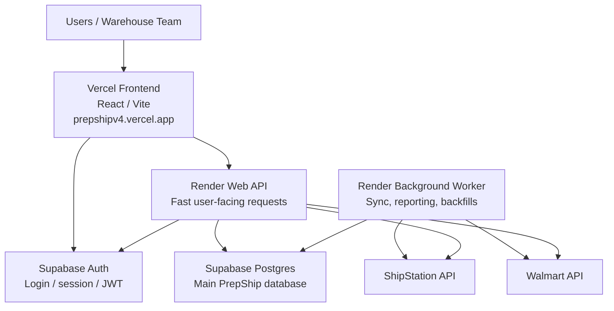
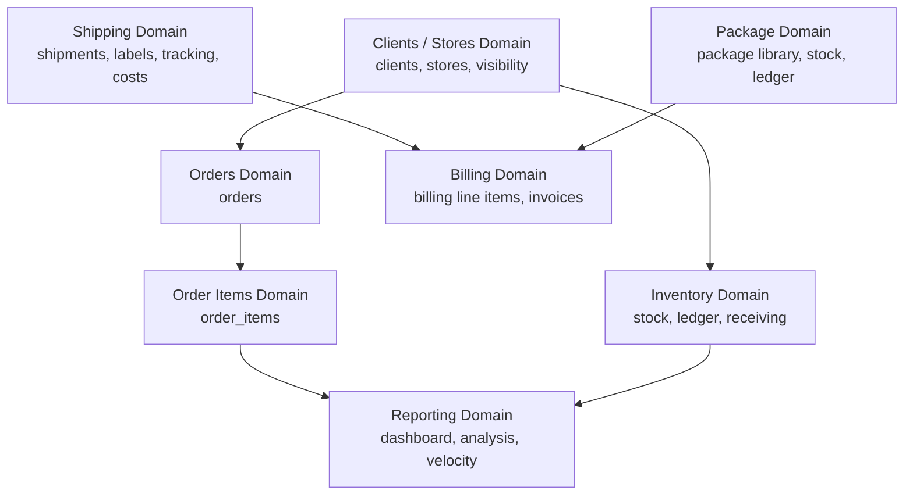

# PrepShip v4 Runtime Split and Domain Architecture Plan

## Purpose

This document turns the boss/OpenClaw architecture discussion into an implementation plan for PrepShip v4.

The core direction is:

- Frontend should serve UI.
- API should serve users.
- Worker should run background jobs.
- Supabase should store auth and source-of-truth data.
- Domain APIs should serve prepared business data instead of forcing pages to stitch raw tables together.

## Target Runtime Architecture

PrepShip v4 should run with:

- 1 Vercel project for the frontend website.
- 1 Render Web API for user-facing backend requests.
- 1 Supabase project for database and auth.
- 1 Render Background Worker for sync jobs, reporting refresh, and heavy processing.



## Why This Is Better

The current risk is that user requests and background work can compete inside or near the same runtime.

Example:

- User opens Dashboard.
- Order sync starts.
- Inventory refresh starts.
- Analysis query runs.
- Billing page recalculates data.

If these compete for the same API process, the website can feel slow or stuck.

The target split is:

- Render Web API = user actions and fast reads.
- Render Background Worker = sync jobs, reporting refresh, backfills, and heavy processing.

This keeps the website responsive while sync continues in the background.

## Pros

### Performance

- User-facing API gets less competition from sync jobs.
- Dashboard, Inventory, Analysis, and Billing can become faster.
- Heavy reporting can be prepared before a user opens the page.
- Fewer timeout risks during active warehouse hours.
- Easier to identify slow areas: frontend, API, worker, or database.

### Reliability

- Worker failures do not necessarily take down the API.
- Long-running jobs are isolated from user requests.
- Retry logic can live in the worker/queue layer.
- API deploys and worker deploys can be monitored separately.
- Users can still work from existing database state if the worker pauses.

### Scaling

- API and worker can use different Render instance sizes.
- Worker can be scaled up during heavy sync/backfill periods.
- API can stay smaller and optimized for low-latency responses.
- Reporting refreshes can run off-peak or in batches.

### Product

- Website can feel more live without polling large payloads.
- UI can show sync status separately from page loading.
- New order import, reporting dashboards, billing generation, and inventory velocity become easier to support.

### Engineering

- Clearer ownership boundaries.
- Cleaner logs and debugging.
- Better place to introduce normalized `order_items`.
- Better foundation for reporting metrics/materialized read models.
- Less duplicated business logic in frontend pages.

## Cons and Tradeoffs

### More Infrastructure

Instead of:

```txt
Vercel + Render API + Supabase
```

PrepShip will have:

```txt
Vercel + Render API + Render Worker + Supabase
```

That means:

- One more service to deploy.
- One more service to monitor.
- One more log stream.
- One more place that can fail.

This is worth it, but it adds operational responsibility.

### More Coordination

The API and worker must agree on:

- Environment variables.
- Database schema.
- Job formats.
- Sync status tables.
- Queue names.
- Metric refresh rules.

Safe deploy order:

1. Database migrations.
2. Worker support.
3. API endpoints.
4. Frontend reads.

### Duplicate Job Risk

If both API and worker can run heavy sync inline, PrepShip risks:

- Two syncs at once.
- Duplicate imports.
- Race conditions.
- Double inventory deductions.
- Conflicting reporting refreshes.

Mitigation:

- Use pg-boss or Postgres advisory locks.
- Make jobs idempotent.
- API should enqueue jobs, not run heavy jobs inline.

### Worker Monitoring Required

A separate worker can silently fail unless we expose status.

The system should track:

- Worker heartbeat.
- Last successful sync.
- Failed job count.
- Last error.
- Current job status.
- Queue depth.
- Rows processed per job.

Suggested API:

```txt
GET /sync/status
GET /worker/status
GET /jobs/recent
```

Suggested UI:

```txt
Orders sync: healthy, last success 42s ago
Inventory refresh: healthy, last success 2m ago
Reporting refresh: failed, retrying
```

### Database Can Still Be The Bottleneck

The worker prevents API/runtime competition, but API and worker still share Supabase Postgres.

If the worker runs huge queries, the API can still slow down.

Mitigation:

- Incremental sync.
- Proper indexes.
- Query timeouts.
- Small batch processing.
- Materialized reporting metrics.
- Avoid live JSONB scans.
- Run large backfills off-hours.

### Eventual Consistency

Background jobs mean the UI may not reflect changes instantly.

Example flow:

```txt
Order arrives in ShipStation
Webhook or scheduler queues job
Worker processes order
Database updates
Metrics refresh
Dashboard updates
```

This delay is usually acceptable, but the UI should show:

- Last synced time.
- Sync in progress.
- New data available.
- Refresh button when needed.

## Does This Solve The Lack Of Domains?

Short answer: not by itself.

The runtime split solves workload separation:

- Vercel = frontend.
- Render API = user requests.
- Render Worker = background work.
- Supabase = database/auth.

But the lack of domains is a code architecture issue.

If the code still works like this:

- Dashboard page calls many APIs and calculates business metrics in React.
- Inventory page mixes inventory state with live order-derived velocity.
- Analysis page expands `orders.items` JSONB directly.
- Billing reconstructs invoice logic from raw orders.
- Multiple pages duplicate source-of-truth calculations.

Then PrepShip still has a domain architecture problem.

Runtime split creates the foundation. Domain refactor solves the code architecture.

## Target Domain Architecture

The backend should gradually move toward domain-based organization.

Suggested future structure:

```txt
src/domains/orders
src/domains/order-items
src/domains/inventory
src/domains/reporting
src/domains/billing
src/domains/packages
src/domains/shipping
src/domains/clients
src/domains/sync
```

Each domain should own:

- Routes.
- Services.
- Queries.
- Types.
- Jobs if needed.
- Source-of-truth rules.
- Metric definitions.



## Domain Ownership Rules

### Orders Domain

Owns:

- Order records.
- Order status.
- Order source.
- Order-level dates and totals.

Does not own:

- SKU analytics.
- Inventory stock.
- Billing invoice totals.

### Order Items Domain

Owns:

- `order_items` table.
- SKU, quantity, unit price, item revenue.
- Client/SKU/date analytics input.

This should replace using `orders.items` JSONB as the all-purpose reporting database.

### Inventory Domain

Owns:

- Current stock.
- Reorder levels.
- Receiving.
- Adjustments.
- Inventory ledger.
- Active/inactive SKUs.

Consumes reporting metrics for:

- Sold 7d.
- Sold 30d.
- Velocity.
- Days supply.

### Shipping Domain

Owns:

- Labels.
- Tracking.
- Carrier.
- Service.
- Label cost.
- Markups applied to shipping cost.

### Billing Domain

Owns:

- Billing config.
- Billing generation.
- Billing line items.
- Billing summaries.
- Invoices.
- Billing detail rows.

Rule:

Billing screens should read generated billing outputs, not recalculate everything live on every page load.

### Package Domain

Owns:

- Package library.
- Package stock.
- Package ledger.
- Package usage.
- Package costs.

### Clients / Stores Domain

Owns:

- Client metadata.
- Active/inactive status.
- Test client status.
- Stores.
- Integration status.
- Sidebar visibility.

### Reporting Domain

Owns:

- Dashboard summary metrics.
- Analysis metrics.
- SKU velocity.
- Inventory reporting metrics.
- Materialized/read-model tables.

## Target Frontend/API Model

Frontend pages should call domain-shaped APIs.

Examples:

```txt
GET /dashboard/summary
GET /dashboard/trends
GET /dashboard/top-skus

GET /inventory/page
GET /inventory/alerts
GET /inventory/:sku/activity

GET /analysis/skus
GET /analysis/daily-sales

GET /billing/summary
GET /billing/details
GET /billing/invoices

GET /orders
GET /orders/:id
```

Frontend pages should not stitch together raw data from:

- Raw `orders.items` JSONB.
- Full order windows.
- Full inventory exports.
- Live billing recalculations.

## Important Design Rules

### Rule 1: API Should Not Run Heavy Sync Jobs Inline

Good:

```txt
POST /sync/orders
  -> enqueue job
  -> return { jobId }
```

Bad:

```txt
POST /sync/orders
  -> fetch 10,000 orders
  -> process everything
  -> block request
```

### Rule 2: Worker Owns Scheduled Jobs

Worker should own:

- Order sync.
- Shipment sync.
- Inventory/package sync.
- Reporting metrics refresh.
- Backfills.
- Billing generation jobs, eventually.

### Rule 3: Use A Job Table Or Queue

Recommended:

- pg-boss, already present in dependencies.
- Or Postgres advisory locks for simpler first step.

Queue benefits:

- Job retry.
- Job locking.
- Job status.
- Concurrency control.
- Failure tracking.

### Rule 4: Jobs Must Be Idempotent

Jobs should be safe to run twice.

Important examples:

- Order import.
- `order_items` backfill.
- Inventory deduction.
- Package sync.
- Reporting refresh.
- Billing generation.

Use:

- Upserts.
- Unique keys.
- Watermarks.
- Job locks.

### Rule 5: Frontend Reads Fast APIs Only

Dashboard should not care whether sync is running.

Frontend should call:

```txt
/dashboard/summary
/dashboard/trends
/inventory/page
/analysis/skus
/sync/status
```

## Updated Roadmap

### Phase 0: Render Background Worker

Goal:

Remove scheduled/background work from the user-facing API.

Deliverables:

- Create Render Background Worker service.
- Move sync scheduler out of API.
- Worker runs order sync, shipment sync, package/inventory sync, and reporting refresh jobs.
- Add worker heartbeat/status table.
- API exposes lightweight sync/worker status endpoint.
- API can enqueue jobs but does not execute heavy jobs inline.

Acceptance criteria:

- Website still loads while worker sync is running.
- Worker logs show job start/finish/duration.
- API logs no longer show scheduler work competing with page requests.
- Frontend can display last sync status.

### Phase 1: Observability

Goal:

Measure slow routes and slow jobs before refactoring major logic.

Deliverables:

- API timing logs.
- Method, route, status, duration.
- Response size where feasible.
- Request ID where feasible.
- Worker job logs.
- Slow query/job alerts.

Acceptance criteria:

- We can answer: which route is slow, how slow, and when.
- We can distinguish frontend delay, API delay, worker delay, and database delay.

### Phase 2: Dashboard + Analysis Source-Of-Truth Cleanup

Goal:

Stop Dashboard/Analysis from relying on raw order windows and live JSONB-heavy calculations.

Tasks:

- Map exact Dashboard and Analysis numbers.
- Define expected source for each number.
- Create Dashboard aggregate endpoints.
- Remove raw order window usage from Dashboard.
- Verify before/after numbers.

Acceptance criteria:

- Dashboard loads from aggregate endpoints.
- Numbers match old behavior.
- Dashboard no longer fetches large raw order windows on initial load.

### Phase 3: Normalize Order Items

Goal:

Create a proper source of truth for SKU/unit/revenue analytics.

Deliverables:

- Add `order_items` table.
- Backfill from `orders.items`.
- Update ingestion to write both `orders` and `order_items`.
- Add indexes.

Suggested indexes:

```txt
order_date
client_id, order_date
sku, order_date
client_id, sku, order_date
order_id
```

Acceptance criteria:

- New orders write item rows.
- Backfilled row counts match expected item counts.
- Dashboard/Analysis can begin moving away from `orders.items` JSONB.

### Phase 4: Inventory Metrics Cleanup

Goal:

Move inventory velocity and effective stock logic out of live JSONB scans.

Deliverables:

- Reporting metrics for sold 7d, sold 30d, velocity, days supply.
- Inventory page reads stock from inventory/inventory ledger.
- Inventory page reads velocity from reporting metrics.

Acceptance criteria:

- Inventory page no longer needs live order item JSON scans for velocity.
- Sold/velocity numbers match expected values.
- Page load is stable under production data volume.

### Phase 5: Shared Frontend Data Layer

Goal:

Standardize frontend data fetching and reduce duplicate requests.

Deliverables:

- Standard React Query hooks:
  - `useClients()`
  - `useStores()`
  - `usePackages()`
  - `useShippingAccounts()`
  - `useMarkups()`
  - `useLocations()`
- Consistent `staleTime`.
- Consistent `gcTime`.
- `enabled` checks for conditional fetches.
- Keep previous data where appropriate.

Acceptance criteria:

- Pages do not duplicate the same startup requests.
- Tab changes reuse cached shared data.
- Loading states are per-panel instead of whole-page when possible.

### Phase 6: Page-Level Lazy Loading

Goal:

Reduce initial JavaScript and page work.

Lazy-load:

- Drawers.
- Modals.
- Charts.
- Settings sections.
- Heavy tables.
- Export tools.

Acceptance criteria:

- Initial route loads less code.
- Heavy UI only loads when opened.
- Build chunks remain understandable.

## Suggested Dev Handoff Checklist

1. Confirm current Render API plan is always-on.
2. Create Render Background Worker.
3. Move in-process sync scheduler from API to worker.
4. Add worker heartbeat/status table.
5. Add `/sync/status` or `/worker/status` endpoint.
6. Add API/worker timing logs.
7. Confirm Dashboard and Inventory page load while sync is active.
8. Start `order_items` migration/backfill plan.
9. Define reporting metric tables/materialized views.
10. Move one page at a time to domain-shaped APIs.

## Boss-Level Summary

PrepShip v4 will run with Vercel for the frontend, Render Web API for user-facing requests, Supabase for auth/database, and a Render Background Worker for sync, reporting refreshes, and heavy jobs.

This separates customer-facing speed from background processing, keeps the app responsive during sync, and creates the foundation for normalized `order_items`, reporting metrics, and near-live updates without overloading the website.

The Render Worker split solves workload separation.

The domain service refactor solves code architecture.

Together, they create the target architecture:

```txt
Runtime split
+ background worker
+ normalized order_items
+ reporting metrics
+ domain services
+ frontend React Query data layer
= faster, safer, more scalable PrepShip
```

